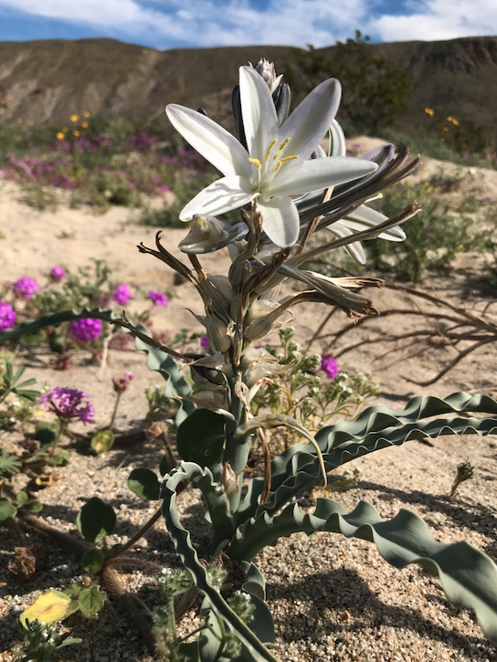
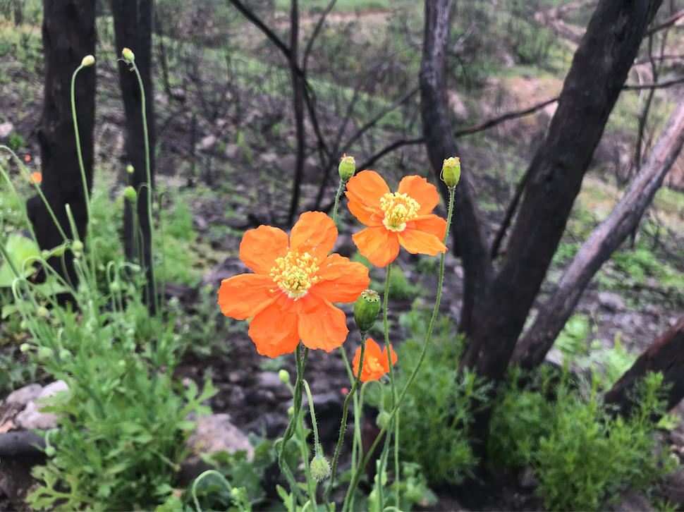
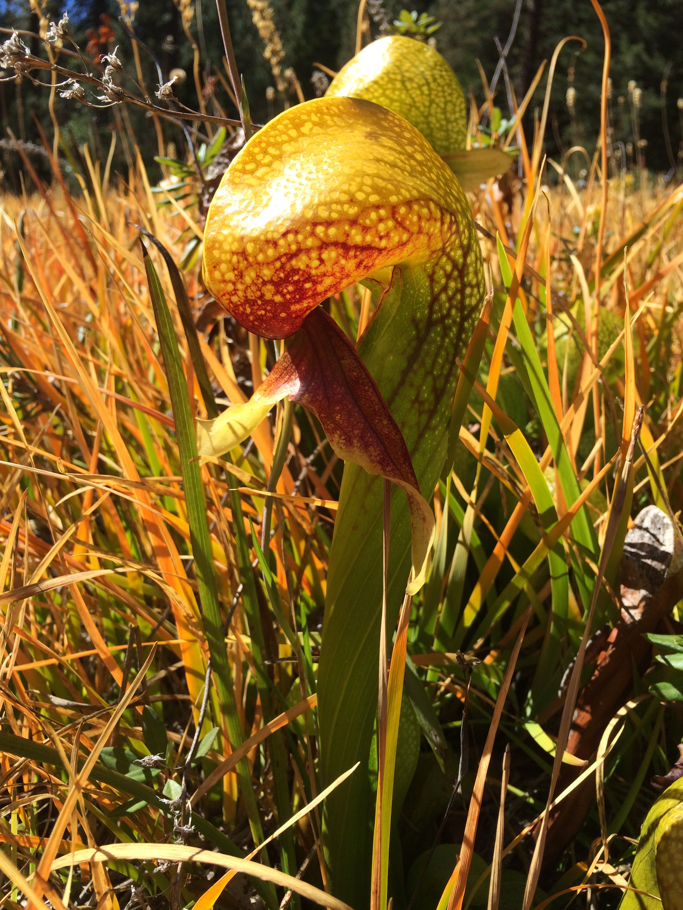

```{r setup, include=FALSE}
knitr::opts_chunk$set(echo = TRUE)
```

### A Gallery of Some of My Favorite California Native Plants

All photos were taken by Hannah Garcia-Wickstrum. Please ask for permission before using. 






